# Software-Development-Assignment-2-Chat-App

## 1.0 Pre-Requisite Information

### 1.1 Project Introduction
This project is a web chat app optimised for mobile use. This chat app is split into two folders, front end and backend. The front end utilises React a JavaScript Framework and css for styling as well as websockets to communicate between the client and the server. The back end is composed of an express JS application wrapped in a http server thus allowing websocket to communicate between the client and the server. The project is composed of two main screens the "Get Started" screen that loads when the user is yet to input a name and the chat room screen that is accessed once the user has input a name.

### 1.2 Installation Instructions 
To install this project first open terminal and input the following command. 
``` 
git clone https://github.com/Gray593/Software-Development-Assignment-2-Chat-App 
``` 
Next open another terminal instance, this is done as a seperate terminal instance is needed for both the back end and front end. Then run these commands in the terminal you have decided is for the front end. 
```
cd frontEnd
npm i 
``` 
Next switch to the back end terminal and run the following.
```
cd backEnd
npm i

```
Do not kill either terminal instance after this as both are needed to run the program.
### 1.3 How to Run
Using the terminals create in the projects installation, run the following command in the "frontEnd" terminal 
```
npm start
``` 
Next run the follwoing command in the "backEnd" terminal 
```
node backEnd.js
```
the front end may take a second to start but dont worry just switch to the back end and run the back end  command as both terminals can run simultaneously.

### 1.4 Group Contributers
I am the sole contributer to this project.

## 2.0 Design Breakdown
In this section several aspects of the design will be planned out to streamline development
### 2.1 Wireframes
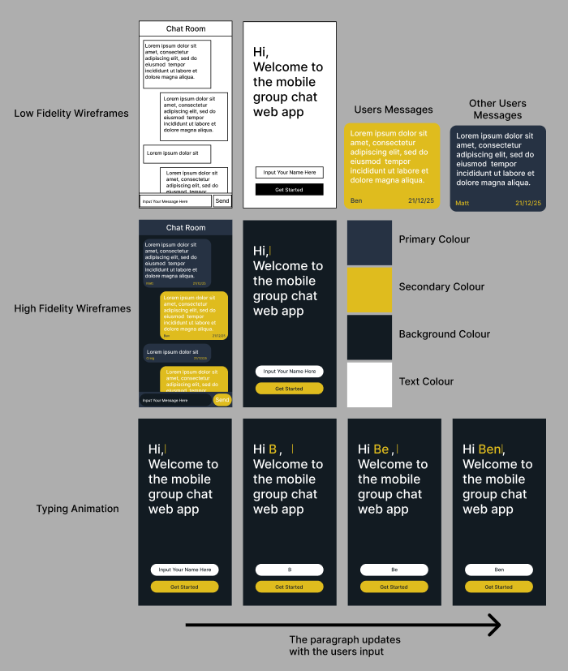
### 2.2 Flowchart

### 2.3 UML Class Diagram

### 2.4 Pseudocode
#### 2.4.1 Client Pseudocode
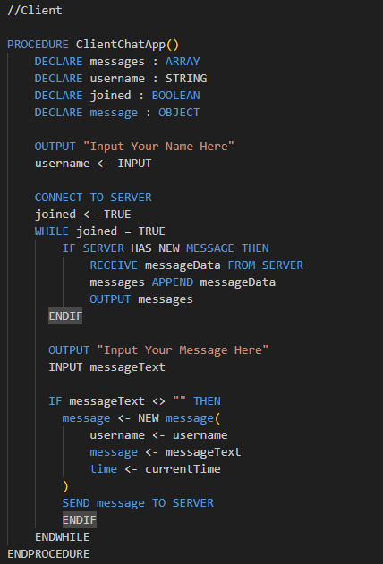
#### 2.4.2 Server Pseudocode

## 3.0 Functional Breakdown
### 3.1 The App Function
The App function is the main function of most react applications, in this instance it contains all of the Html and JavaScript for the front-end of this project except the message component, which is still called in the return of this function. As this function encompasses most of the application only sections of code not included in other functions will be analysed in this section.

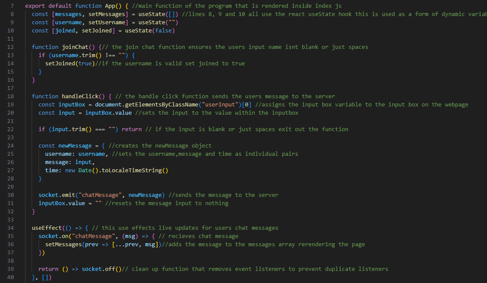

The only code in this function that is not contained with in another function are the react hooks and the return.
#### 3.1.1 UseState React Hooks
The useState hook is Reacts approach to dynamic variables, in this instance the App function uses three use state hooks to sore the messages array, the username string and the joined boolean that is only set to True once the user inputs a valid name. The use state hook contains two components that can be utilised the first is a variable that can be used to reference the value of the hook and the second is a function that allows the variables value to be changed. This is great as it allows the page to update in real time and prevents the need to reload the page that would be present in base JavaScript. To help better understand the useState hook both the react documentation (React, 2025b)and an introductory video to useState by Web Dev Simplified were used throughout development (Web Dev Simplified,2020).

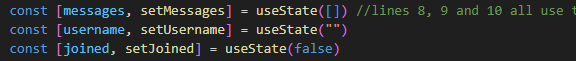
#### 3.1.2 UseEffect React Hooks
The second React hook utilised is the useEffect hook. The useEffect runs the code within the function within the hook whenever the condition at the end of the hook is met. In this instance the useEffect hook is utilised to update the messages array whenever a new message is received by adding the new message to the end of the array containing the already received messages. To help better understand the useEffect hook both the react documentation (React, 2025a) and an introductory video to useEffect by Cosden Solutions were used throughout development (Cosden Solutions,2023).

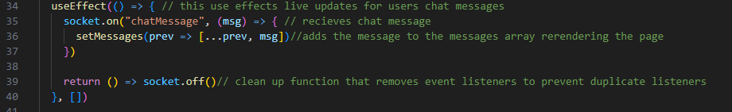
#### 3.1.3 Return Section
The final sections of the app function that aren't other functions are the two returns at the end of the function. The First return function only displays when the joined variable is equal to false. This return is responsible for displaying the initial welcome page that prompts the user to input there name. While developing this section it was difficult to space the text properly as it is in the design. To remedy this issue the text is split into multiple divs to ensure it is always spaced properly.

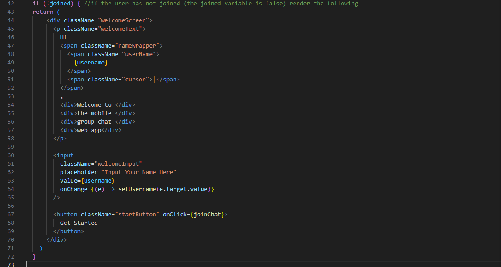
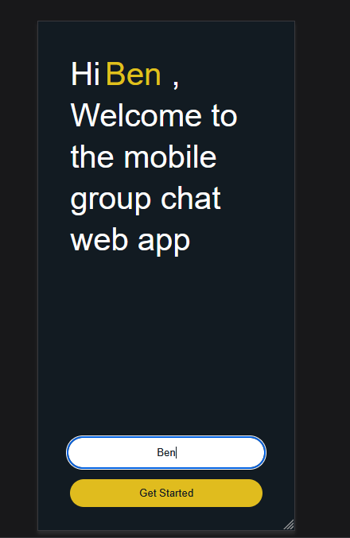

The second return displays the messaging interface and is only displayed after the user has input a valid username. This return manages to display every message in the messages array by mapping them to the corresponding message component. Unlike in the design the message now displays the time its sent rather than the date as this was deemed more relevant to everyday use.

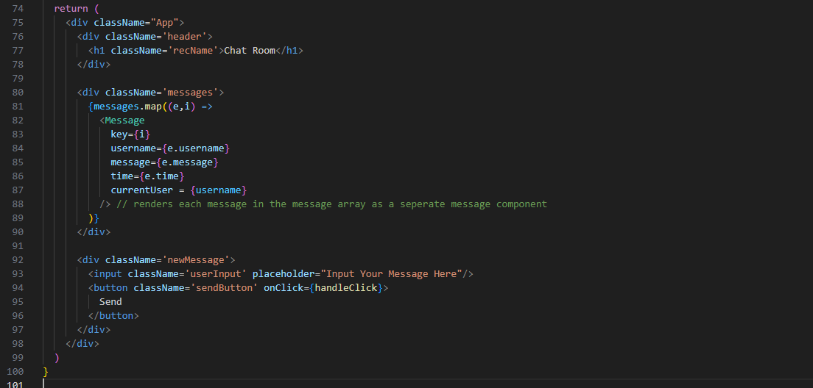
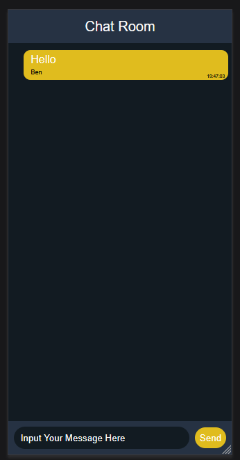

### 3.2 joinChat Function
The joinChat function is very simple, it is called when the get started button is pressed and ensures the username that has been entered is valid by taking out all the spaces and checking if it still has characters inside. If this condition is met the joined state is set to True and the messaging page of the web app is rendered.

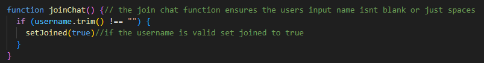

### 3.3 handleClick Function 
The handleClick function is called when the send button on the messaging page is pressed. It first finds the input field in the DOM then ensures the input is valid in the same way the username is checked. When developing making the check a function was considered  as the same check is used in two places but was deemed unnecessary as the process is very short. Then the text is assigned to its corresponding value in the message object along with time and sender this is then sent to the server. After this the input box is cleared to allow for the process to repeat itself. When developing the socket.io documentation was very helpful (Socket.io,2025b).

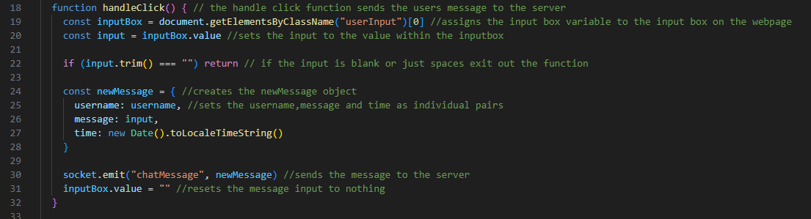

### 3.4 Messaging Component

The messaging component is used in the second return function to render the messages in the messaging interface. Structure wise the component is very similar to a function with Props being passed into the component being used to convey information from the main page to the component. Within the html temperate literals are used to determine the class name for styling based on the sender of the message. To accomplish this the MDN documentation was very helpful (Mozilla, 2025)

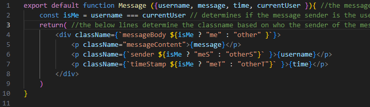

### 3.5 Server Breakdown
While not a function the server file found in backEnd.js is essential to this web apps functionality. The server allows multiple users to communicate between each other and is the centerpoint of this application. This section would have been very hard to complete if not for the socket.io documentation (Socket.io,2025a). To start an express.js instance is created this is then wrapped in a http server which is assigned to the io variable as a new server to allow for websocket to connect to the application. This caused a lot of problems in development but was eventually solved through reading the above documentation and trial and error. Next the users variable is created this is very useful for testing as it counts the amount of clients connected to the server and can be essential in deducing whether an error is client or server side. The following lines in the "io.on" function manage the user count as users disconnect and reconnect and also broadcast messages to all connected clients. Finally the last lines specify which port the server is run on, this is only relevant locally and would need to be change if the project were to be hosted.

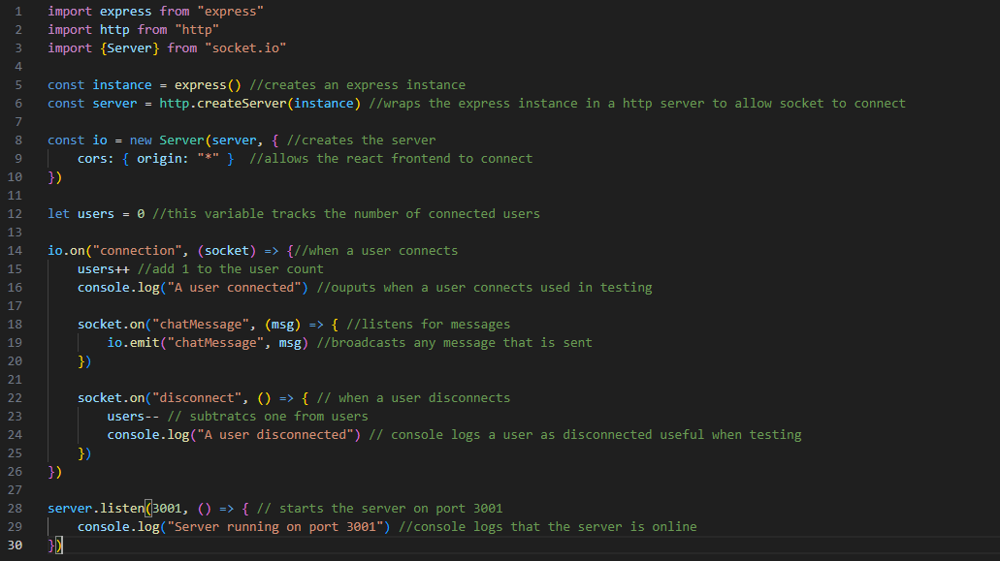

## 4.0 User Profiles and Requirements
### 4.1 User Profiles
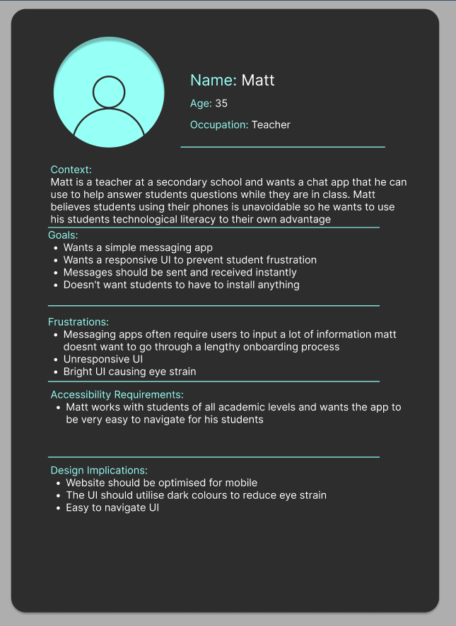
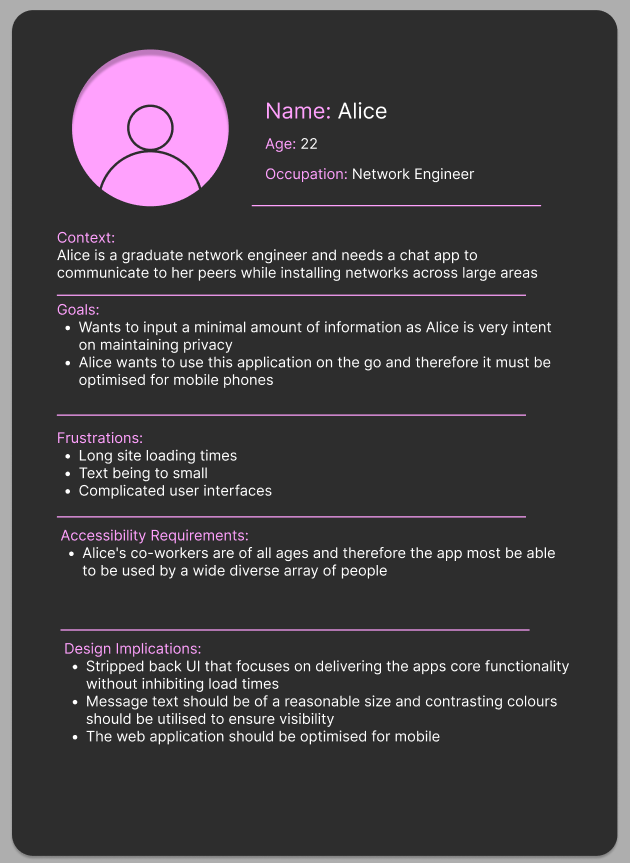
### 4.2 User Requirements 
* The system must allow users to join the chat by entering only a username, without requiring account creation or installation of additional software. 
Link to User Profiles: Both Matt and Alice want to avoid lengthy onboarding processes and value quick access. 
* The system must allow users to send and receive messages instantly with little to no delay.
Link to User Profiles: Matt requires immediate responses to student questions, and Alice expects low-latency communication while working on site.
* The application must be optmised for mobile.
Link to User Profiles: Matt expects students to use their phones in class, and Alice uses the application while on the move.
* The user interface must be snappy and responsive.
Link to User Profiles: An unresponsive UI would frustrate Matt's students.
* Message text must be displayed at a readable size and the colours used must be contrasting.
Link to User Profiles: Alice identified small text as a frustration, and Matt works with students of varying abilities and impairments.
* Application should allow users to maintain their privacy by only asking for there username.
Link to User Profiles: Alice values privacy, and Matt is not allowed to compromise the students privacy.
* The interface must be simple and easy to navigate for users with varying levels of technical ability.
Link to User Profiles: Alice values privacy, and Matt wants to minimise barriers for student participation.
* The user interface should use darker colours to prevent eyestrain.
Link to User Profiles: Matt specifically identified bright interfaces as a source of discomfort during prolonged use.
### 4.3 System Requirements
#### 4.3.1 Functional Requirements
* The system will be accessible through a web browser without requiring software installation.
* The system will use WebSockets to enable real-time messaging.
* All users will receive every message that is sent.
* Each message will have the senders username and time stamp attached
* The clients will instantly display all received messages  
#### 4.3.2 Non-Functional Requirements
* Messages will be delivered with no delay ensuring the application performs as required.
* The interface will be intuitive enabling anyone to use the app ensuring a high level of usability.
* The application will use readable font sizes and high-contrast colours.
* The interface will use a dark colour scheme to minimise eye strain.
* The system will function consistently across all modern mobile browsers and while the web app will be optimised for mobile it should also run on desktop.
## 5.0 Testing
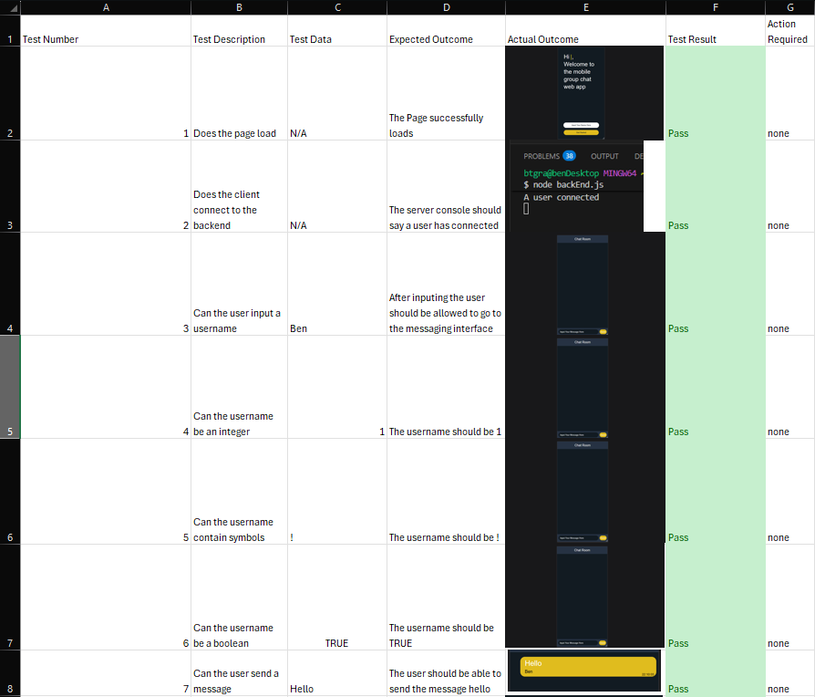
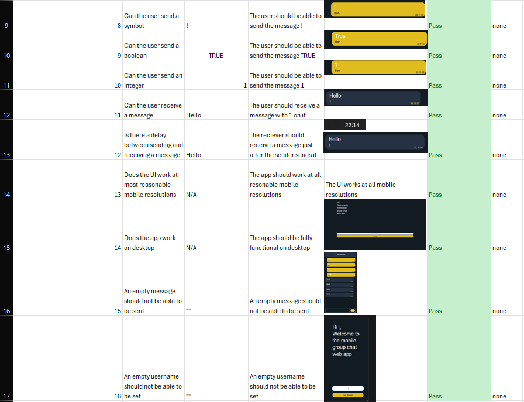
## 6.0 Development Strategy Review 
While developing this project the strategy utilised was multifaceted, as this allowed for a streamlined linear approach to development, while allowing an iterative approach to tasks that demanded extra attention. This worked well as the linear approach, which is very reminiscent of the waterfall methodology, ensured a clear structure (Lucidchart, 2025) and a smooth testing and design process that can be informed by the requirements established by the user profiles and requirements (One Beyond, 2023). Despite the above advantages, the linear development process wasn't completely streamlined. The process adopted a lot of the disadvantages of waterfall, for example there was very limited flexibility as once a phase of the development was completed it was very difficult to retroactively repair problems from previous phases (Indeed, 2023). Unfortunately, due to the nature of the waterfall methodology there was a very limited quantity of deliverables until the coding stage of development started, which is very late into the overall process (GeeksForGeeks, 2018). Thankfully once the coding process an iterative approach was employed a lot more frequently this led to great results. By replicating the cyclical nature present in the Agile methodology, a lot of advantages were gained that in turn made the development process a lot easier. For example, by deconstructing the problem into smaller more manageable development cycles (University of Minnesota, 2022), the logic between the client and server could be homed in and focused on before worrying about styling and other features that were surplus to the MVP. 

Furthermore, by frequently analysing code at a functional level, a standard of optimisation was able to be achieved that would not be possible in the waterfall methodology (GeeksForGeeks,2020). However, while this iterative approach did have a lot of advantages it did lead to scope creep which is a known issue of the agile methodology (Zheherau, 2024). This in turn led to features being added that were not desired by the users, that then had to be removed due to a poor level of implementation caused by time constraints. An example of this is direct messaging as while perfectly possible using Websocket was not asked for by users in the user profiles or requirements. 

While for the most part this hybrid strategy for the sake of both simplicity and ensuring a quality output a purely iterative approach would have been more effective. As throughout the project the understanding of the user's needs and of the technological limitations of Websocket grew tremendously. Therefore a stronger emphasis on iteration from the outset would have improved flexibility and enhanced the final output.

## 7.0 Evaluation
When evaluating a project’s success, it is imperative to compare how the project meets both the user and system requirements. Throughout this project meeting the requirements has been at the forefront of development. In this section the success of the chat app will be determined based on the aforementioned requirements.
### 7.1 Evaluating Fulfillment of User Requirements
The first user requirement focuses on the user’s ability to input a username without a need for a long account creation process. This has been effectively achieved, as can be observed in test three through six. The need for a simple registration process was reiterated in the sixth user requirement which emphasised privacy. This requirement was at the crux of many design decisions as can be observed in the design board present in section 2.1. The second user requirement focuses on sending and receiving messages in real-time. This was achieved as can be observed in tests seven through twelve, which display the user’s ability to send and receive messages containing any characters in real-time. To achieve this WebSocket in the form of Socket.io was pivotal, it greatly streamlined the development of the server code in backEnd.js and ensured a superior level of inter-connectivity between the client and server. The remainder of the user requirements are less technical and focus mainly on design choices and their subsequent implementation. Overall, the users demanded a responsive mobile centric user interface that prioritises clarity and simplicity. This was at the heart of the design of this web application as can be seen in the design board and later in the final product. The design that was utilised is very simple but effective, the user knows exactly how to a use the application. Any unnecessary features have been abstracted away to successfully meet the users demands. Furthermore, a dark colour scheme has been employed as per the users request to ensure the interface does not cause eye strain.
### 7.2 Evaluating Fulfillment of Functional System Requirements
When it comes to the system requirements the chat app meets all functional and nonfunctional requirements. The system is easy to access as can be seen in test one, WebSocket has been successfully implemented to allow real-time messaging. All users connected receive any message sent as can be observed throughout testing, all messages are displayed as soon as they are sent as can be seen in test twelve where the message is received the same minute it is sent. This was very easy to prove thanks to the time stamp and sender username at the bottom of every message this also fulfilled the final system requirement. In the design this was originally meant to be the date the user was sent but this was later changed to the time the message was sent to better meet the user’s needs. 
### 7.3 Evaluating Fulfillment of Non-Functional System Requirements
The chat app also meets all non-functional requirements outlined in the requirements section. The app performs well with all messages being delivered in real-time as can be observed in test twelve. The interface is intuitive to navigate, using a dark colour scheme while maintaining readability through the use of a large font that is white in colour to contrast the background. The system also functions on all reasonable be resolutions as can be seen in test thirteen, this was tested by using Firefox's developer tools to alter the resolution of the page to test at multiple resolutions but proved difficult to provide evidence for in a brief manner. 
### 7.4 Evaluating Potential Future Improvements
In future to improve the chat app, there are multiple features that will be added. The first of which is a user count within the application, this could be implemented quite easily as the user’s variable in backEnd.js already tracks the number of users and would just need to be integrated into the client. Next to improve clarity a banner will be added in the chat window to display when a new user joins that includes the users selected username, this may be more challenging to implement as may require the use of the socketid property that was previously utilised when attempting to add direct messaging, a feature that was later removed due to it being surplus to requirement. Another area that could be expanded on is testing; a lot of informal testing was carried out throughout each iteration of the development cycle. If this were documented in a more formal manner the clarity of the testing cycle could be greatly improved.
### 7.5 Conclusion and Overall Evaluation
Overall, this project can be considered successful, as all user and system requirements have been met and validated through testing. The final product delivers a simple, responsive, and real-time chat application that aligns closely with user needs. While there are areas for future enhancement, these do not detract from the effectiveness of the current implementation and instead provide a clear path for further development.
